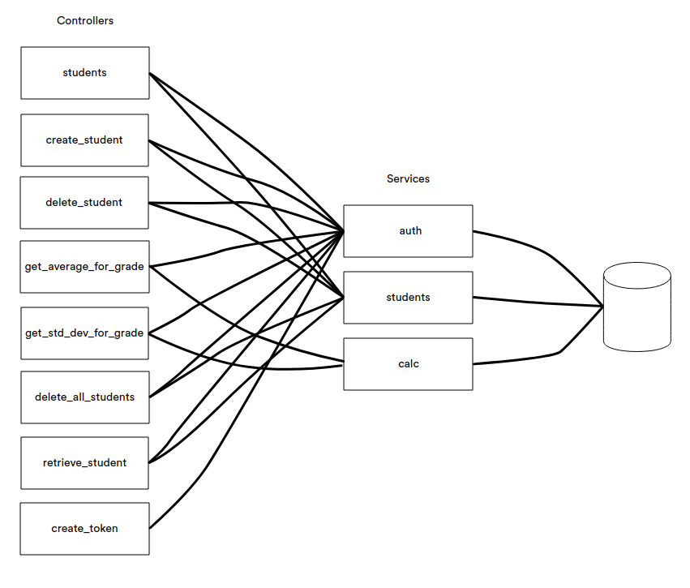

# Students API

## Running app
In order to launch application execute following command in terminal

```./run.sh```

## Viewing API docs
API docs are available at [http://localhost/docs](http://localhost/docs)

## Viewing logs
Logs can be viewed by running the command below

```./logs.sh```

## Stopping app
App can be stopped by issuing the following command

```./stop.sh```

## Running tests
Run the command below to launch test suite

```./test.sh```

## App components


### Controllers

#### students
Controller can be run by hitting [http://localhost/students](http://localhost/students) using GET verb.

Response is a list of all students stored in the DB.

#### create_student
Controller can be run by hitting [http://localhost/students](http://localhost/students) using POST verb.

Controller receives student data and stores it in the DB.

#### delete_student
Controller can be run by hitting [http://localhost/students/1](http://localhost/students/1) using DELETE verb.

Controller is responsible for specific student removal.

#### get_average_for_grade
Controller can be run by hitting [http://localhost/stat/grade/1](http://localhost/stat/grade/1) using GET verb.

Controller returns average score for a specific grade.

#### get_std_dev_for_grade
Controller can be run by hitting [http://localhost/stat/std-dev/1](http://localhost/stat/std-dev/1) using GET verb.

Controller returns standard score deviation for a specific grade.

#### delete_all_students
Controller can be run by hitting [http://localhost/students](http://localhost/students) using DELETE verb.

Controller removes all students from DB.

#### retrieve_student
Controller can be run by hitting [http://localhost/students/1](http://localhost/students/1) using GET verb.

Controller returns data stored in DB for a specific student.

#### create_token
Controller can be run by hitting [http://localhost/token](http://localhost/token) using POST verb.

Controller returns authentication token for a specific user.


### Services

#### auth
Service is responsible for user authentication (authorization is not required yet).

#### calc
Service is responsible for average score and score standard deviation calculation.

#### students
Service is responsible for student data handling.
